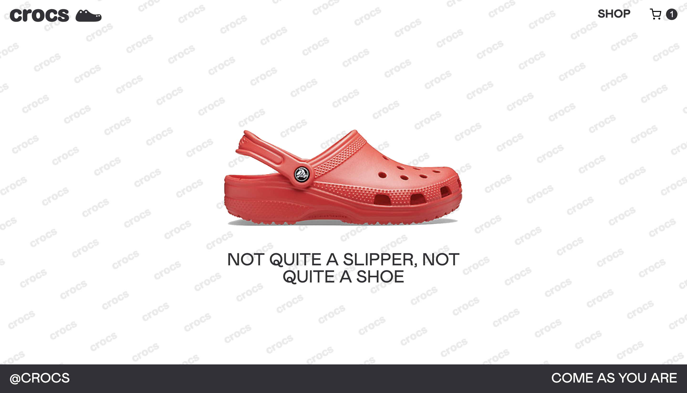

# Shopping Cart

### This is a mock e-commerce site (created to practice routing using react-router-dom). 

## Live Demo

[Visit the site](https://currytay.github.io/shopping-cart/)

**Note:** This website is best viewed on high res screens (1080p and up). Check the [improvements section](#improvements) for future updates.

**Landing page ↓**

**Add to cart demo ↓**

## Project Details

### Prompt

From The Odin Project's [curriculum](https://www.theodinproject.com/courses/javascript/lessons/shopping-cart). 

### Built With

- ReactJS (bootstrapped with [Create React App](https://github.com/facebook/create-react-app))
- HTML5
- CSS3

## Improvements

Future features / opportunities for improvement:

- Make website responsive
- Add hover animation to landing page
- Add ability to increase / decrease quantity of each item in cart
- Add message to display when user adds item to cart

## Acknowledgements

Landing page and logo inspired by [Stephen Kelleher Studio's](https://stephenkelleher.com/) Crocs [case study](https://stephenkelleher.com/Crocs). Additional inspiration taken from the [SSENSE website](https://www.ssense.com/en-us).